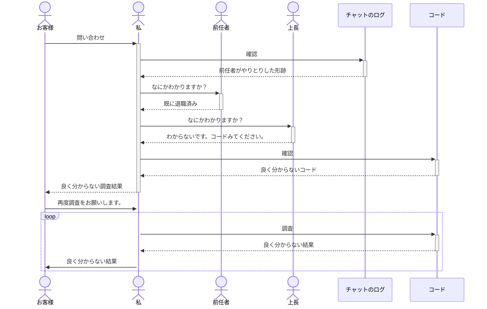
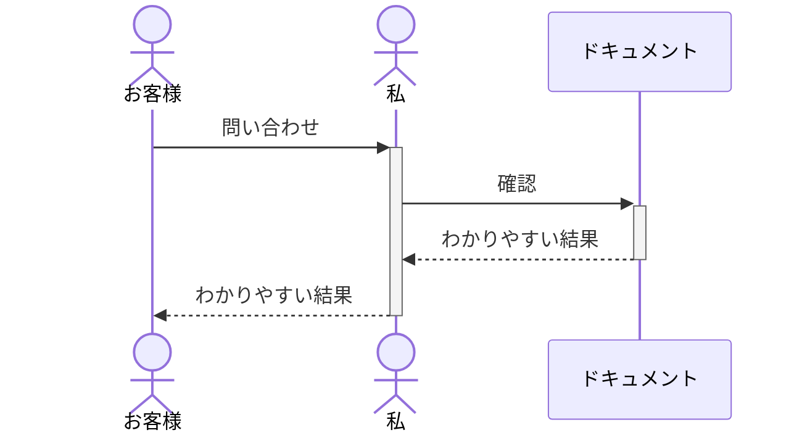
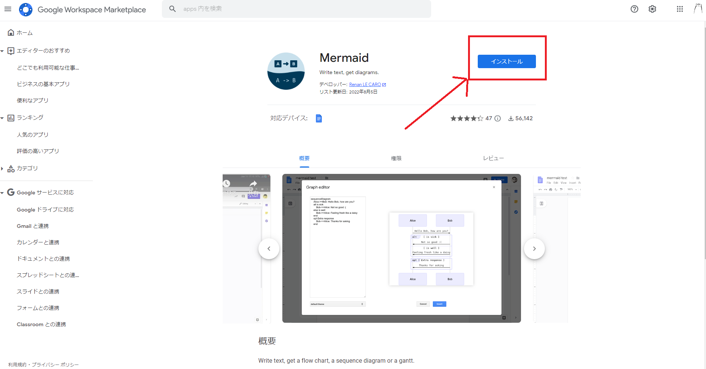
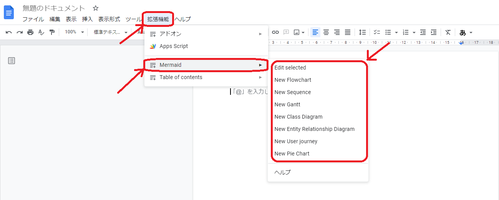
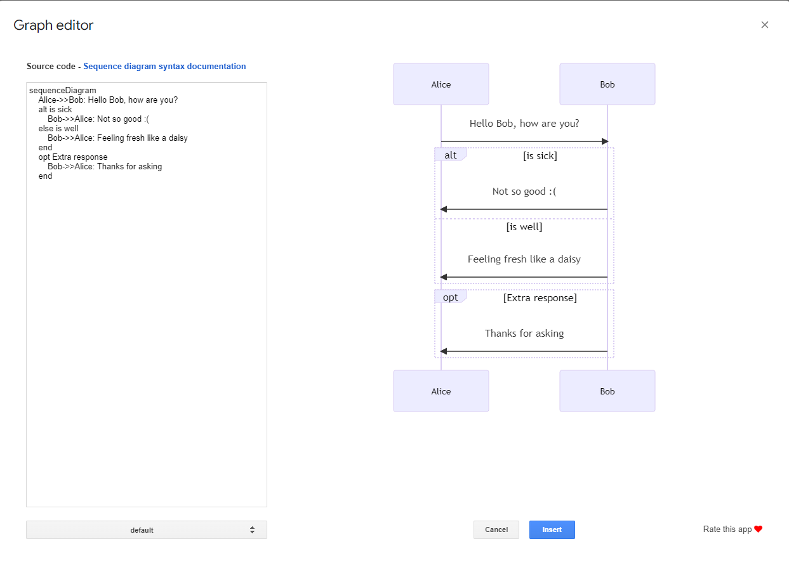

# mermaid
mermaid.jsの社内共有用

## 目次
- 目的
- 枕「ドキュメント大事だよね」というお話
    - 問題が発生した場合（ドキュメントがない世界）
    - 問題が発生した場合（ドキュメントがある世界）
- mermaid.jsとは？
- 使い方
    - mermaid Online Editor
    - Google docs
- 書き方

## 文章の目的
会社自体（少なくとも私が今まで対応した案件では）ドキュメントが少ないので
mermaid.jsを紹介して、社内のドキュメントの総数を改善したい。

## 枕「ドキュメント大事だよね」というお話
### 問題が発生した場合（ドキュメントがない世界）

### 問題が発生した場合（ドキュメントがある世界）

## mermaid.jsとは？
[github.io](https://mermaid-js.github.io/mermaid/#/)によると

> It is a JavaScript based diagramming and charting tool that renders Markdown-inspired text definitions to create and modify diagrams dynamically.<cite>（[github.io](https://mermaid-js.github.io/mermaid/#/)）</cite>

JavaScriptをベースにした作図ツールです。
Markdown的な書き方で動的に図の作成および修正を行えます。

テキストベースなので保守がしやすく。  
しょーもないカチカチクリック作業から解放されます。  

[2022年2月14日にGitHubでサポートされた](https://github.blog/2022-02-14-include-diagrams-markdown-files-mermaid/)様なので、作図ツールのデファクトスタンダードになるのではと思っております。  
是非、社内標準にしていただきたい。

## 使い方
- 各エディタ、システムへの導入については[ここ](https://mermaid-js.github.io/mermaid/#/./integrations)を参照。  
VScode, Vim, Sublimeのプラグイン等で使用できるようなので、使用環境に併せてプラグインをインストールしてください。

今回は、ディレクターが使用できるように下記を紹介
- [mermaid Online Editor](https://mermaid.live/)
- [Google docs](https://docs.google.com/)

### mermaid Online Editor
[mermaid Online Editor](https://mermaid.live/)を開いてみてね。  
以上

### Google docs
1. [こちらのリンク](https://workspace.google.com/marketplace/app/mermaid/636321283856)を開く
1. インストールをクリック

1. 許可やら云々を「はい」で進む。
1. [Google docs](https://docs.google.com/)を開く
1. ドキュメントを新規作成
1. 拡張機能 > mermaid > 作成する図の種別を選択

1. WYSIWYGが開くので、好きなように描いてどうぞ

## 書き方
[公式ドキュメント](https://mermaid-js.github.io/mermaid/#/)のほうが100倍分かりやすいですが、せっかくなので一応用意しました。
- [シーケンス](./SequenceDiagram)