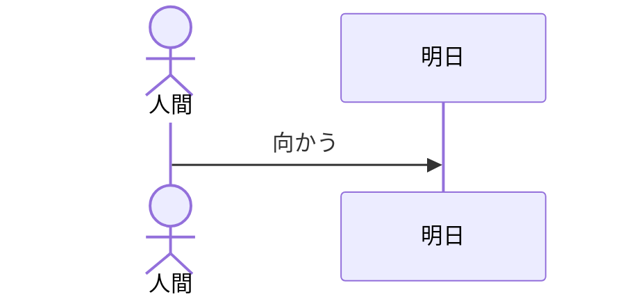
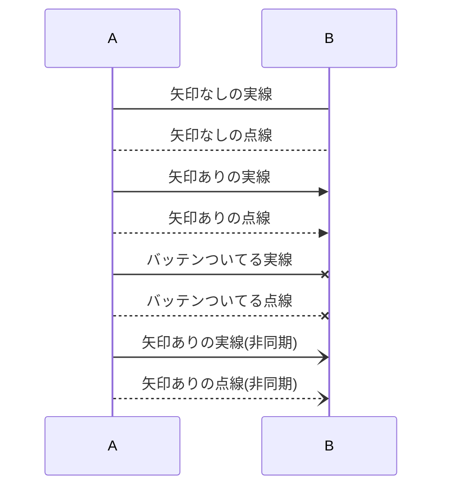
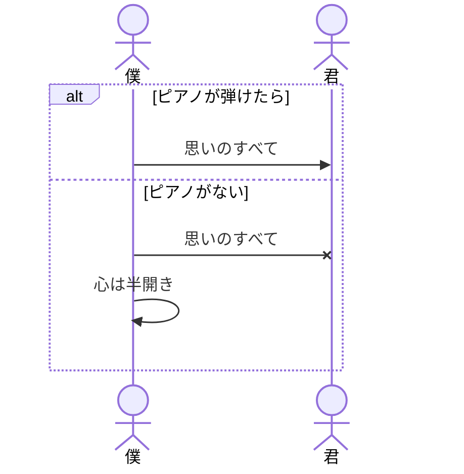
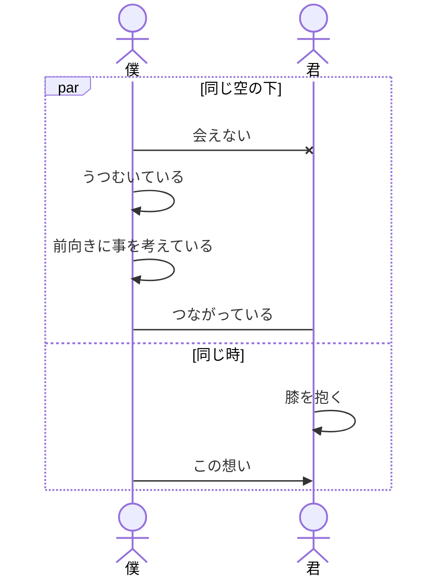
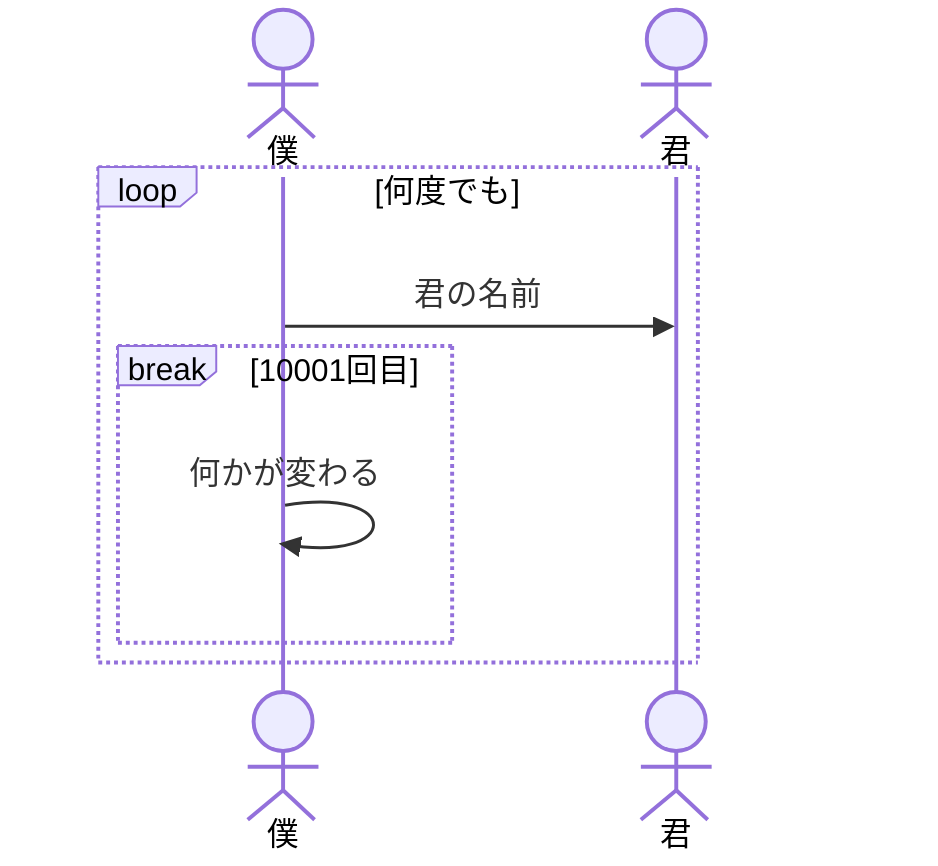
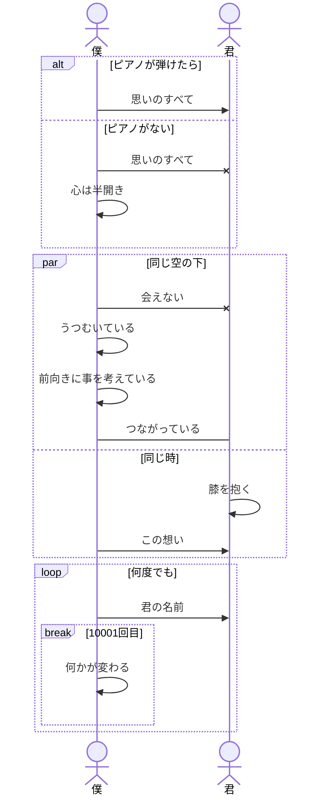

mermaid.js式シーケンス図の書き方講座
===

## 文章の目的
mermaid.jsの書き方社内共有用（シーケンス編）
絶対[こっち](https://mermaid-js.github.io/mermaid/#/./sequenceDiagram)のほうが分かりやすい

## 基本形

mermaid.jsにおけるシーケンス図は下記の形で作成します。

```
sequenceDiagram　# シーケンス図ですよと宣言
    # 登場人物の宣言
    Actor human As 人間
    participant tomorrow As 明日

    # メッセージを書く
    human->>tomorrow:向かう
```



### 矢印（メッセージ）
メッセージには下記の種類があります。

|Type|Description|
|----|-----------|
|->|矢印なしの実線|
|-->|矢印なしの点線|
|->>|矢印ありの実線|
|-->>|矢印ありの点線|
|-x|バッテンついてる実線|
|--x|バッテンついてる点線|
|-)|矢印ありの実線(非同期)|
|--)|矢印ありの点線(非同期)|

#### サンプル

```
sequenceDiagram
    A->B:矢印なしの実線
    A-->B:矢印なしの点線
    A->>B:矢印ありの実線
    A-->>B:矢印ありの点線
    A-xB:バッテンついてる実線
    A--xB:バッテンついてる点線
    A-)B:矢印ありの実線(非同期)
    A--)B:矢印ありの点線(非同期)
```



### フラグメント（囲い）について

基本は
```
フラグメント名 説明
    処理内容
end
```

です。

#### alt
分岐で使用
##### サンプル
```
sequenceDiagram
    Actor m As 僕
    Actor y As 君
    # alt
    alt ピアノが弾けたら
        m->>y:思いのすべて
    else ピアノがない
        m-xy:思いのすべて
        m->>m:心は半開き
    end
```



#### par
並列処理で使用
##### サンプル
```
sequenceDiagram
    # 参加者を宣言
    Actor m As 僕
    Actor y As 君

    # par 並列処理で使用します
    par 同じ空の下
        m-xy:会えない
        m->>m:うつむいている
        m->>m:前向きに事を考えている
        m-y:つながっている
    and　同じ時
        y->>y:膝を抱く
        m->>y:この想い
    end
```



#### loop
繰り返し処理で使用
##### サンプル
```
sequenceDiagram
    # 参加者を宣言
    Actor m As 僕
    Actor y As 君

    # loop 繰り返し処理で使用します
    loop 何度でも
        m->>y:君の名前
        break 10001回目
            m->>m:何かが変わる
        end
    end
```




